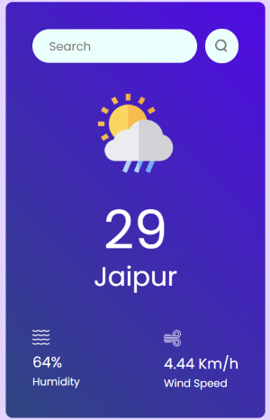

# 🌦️ React Weather App


[](https://reactjs.org/)
[](https://openweathermap.org/api)

Ever wondered if you should grab a jacket or an umbrella before heading out? This project was built to answer that exact question. The React Weather App provides a clean, simple, and elegant interface to get instant weather forecasts for any city around the globe. It's a perfect project for demonstrating core React concepts, API integration, and modern web development practices.

## ✨ Core Features

-   **Live Weather Data:** Fetches real-time weather information from the OpenWeatherMap API.
-   **Global City Search:** Instantly retrieve the forecast for any city worldwide.
-   **Detailed Forecast:** Displays essential information like temperature, humidity, and current weather conditions (e.g., Clear, Clouds, Rain).
-   **Dynamic Icons:** Shows a weather icon that corresponds to the current forecast.
-   **Clean UI:** A minimalist and user-friendly interface built with React.

## 📸 Application Preview

A glimpse of the application in action, showing the weather for Jaipur.



## 🛠️ Tech Stack

This application is built using a modern and efficient technology stack:

-   **Frontend:** [React.js](https://reactjs.org/)
-   **API:** [OpenWeatherMap API](https://openweathermap.org/api)
-   **Styling:** CSS (embedded within the component)

## 🚀 Getting Started

Follow these instructions to get a copy of the project up and running on your local machine for development and testing purposes.

### Prerequisites

You need to have [Node.js](https://nodejs.org/) (which includes npm) installed on your system.

### Setup and Installation

1.  **Clone the Repository**
    ```sh
    git clone [https://github.com/Kumarpal613/Weather-App.git](https://github.com/Kumarpal613/Weather-App.git)
    cd Weather-App
    ```

2.  **Install Dependencies**
    Run this command in the project's root directory to install all the necessary npm packages.
    ```sh
    npm install
    ```

3.  **Set Up Your Environment Variables**
    For security, it's best to store your API key in an environment file instead of directly in the code.

    * Create a file named `.env` in the root of your project folder.
    * Go to [OpenWeatherMap](https://home.openweathermap.org/api_keys) and get your free API key.
    * Add the following line to your `.env` file, replacing `YOUR_API_KEY` with your actual key:
        ```
        VITE_APP_ID =YOUR_API_KEY
        ```
    * This project's `.gitignore` file should already be configured to ignore `.env`, ensuring your key stays private.

4.  **Update the Code to Use the API Key**
    In the `src/App.js` file, find the line where the `apiKey` is defined and change it to use the environment variable:
    ```javascript
    // Replace the old way: const apiKey = "your_key_here";
    // With the new, secure way:
    const apiKey = process.env.VITE_APP_ID;
    ```

5.  **Run the Application**
    Start the development server.
    ```sh
    npm start
    ```
    The application will open automatically in your browser at `http://localhost:3000`.

